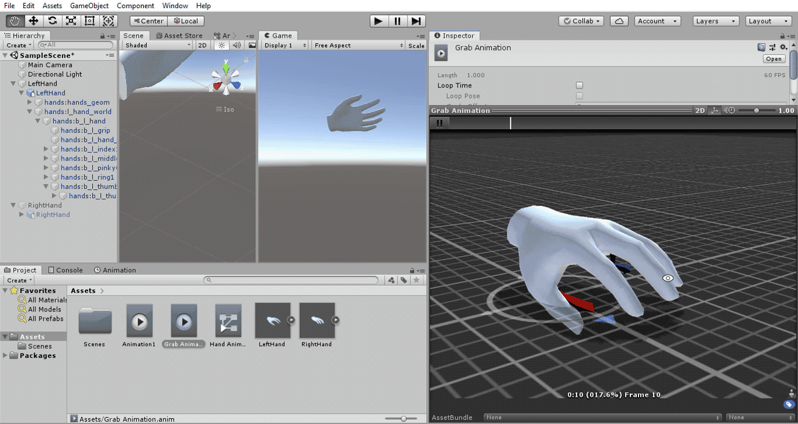

# EMG_SignalAnalysis
Repository for EMG based rehabilitaion project. Placement guide for electrodes (from delsys): https://www.delsys.com/downloads/TECHNICALNOTE/101-emg-sensor-placement.pdf

Updates:
- [2/Jan/2020]  Signal Processing in Python
- [8/Jan/2020]  Signal analysis on simulated EMG Signals
- [11/Jan/2020] FFT, Power Spectral Density, Autocorrelation of time domain for feature extraction
- [12/Jan/2020] Feature extraction and activity recognition (UCI) Part-I
- [13/Jan/2020] Data collection experiment for single channel EMG
- [16/Jan/2020] Starting Colab and XR Project Integration
- [21/Jan/2020] Selecting mean and variance as features and analyzing
- [29/Jan/2020] Binary classification script and plot added
- [01/Feb/2020] Added Unity3D hand hard-coded animation
- [03/Feb/2020] NN Classification results for 3 plots added
- [06/Feb/2020] Serial (wired/wireless) port data analysis code
- [15/Feb/2020] Unity realistic code-based modelling completed in C#
- [25/Feb/2020] Real-time data in Unity via COM port available
- [20/Mar/2020] (Offline) Onset EMG burst detection algorithms

